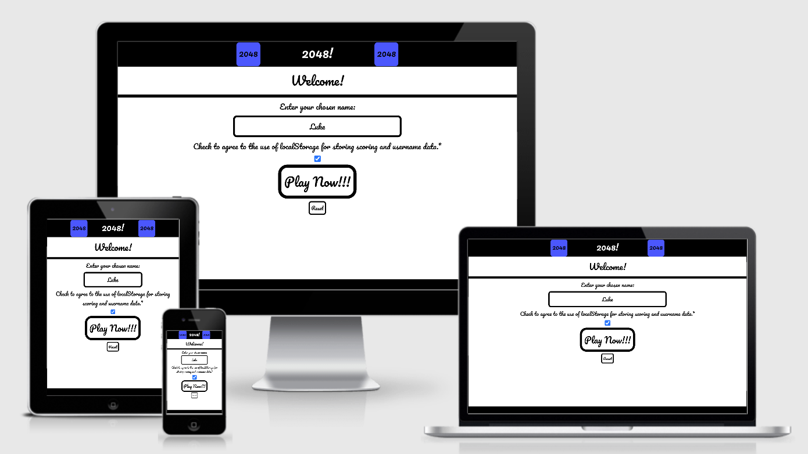
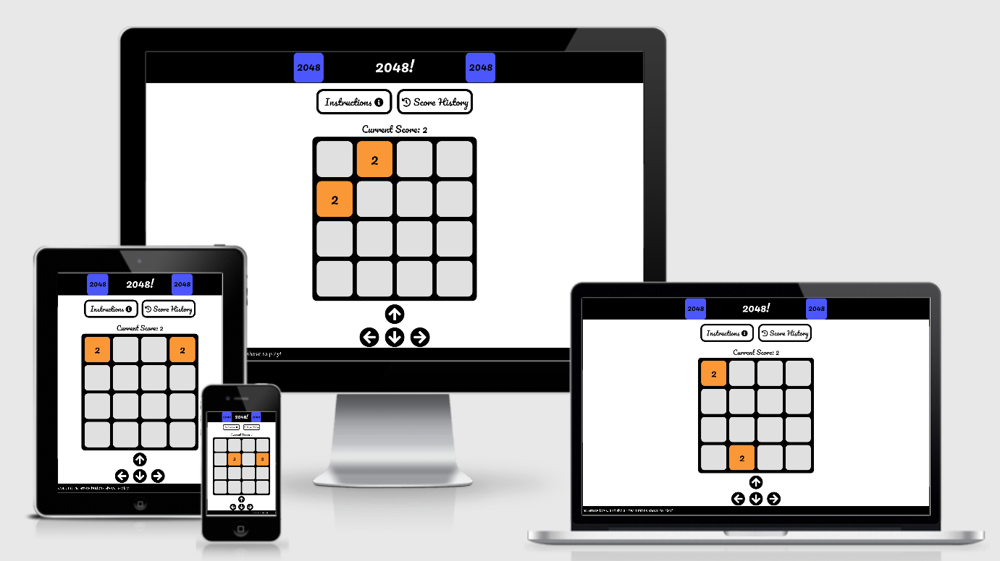

# 2048 - [Live Site](https://lukebinmore.github.io/2048/)

**2048** is a game site aimed at those that like a mathmatical challenge, looking to put their strategy and numeric skills to the test.

The purpose of the site is to host the 2048 game created in JavaScript, and provide access to a mathmatical and strategic game. The purpose of the game is to provide mental stimulation and entertainment to the players.

The main aim of this project was to create a simple, and entertaining game that challenges players to think strategicly.

## Table Of Contents
- [2048 - Live Site](#2048---live-site)
  - [Table Of Contents](#table-of-contents)
  - [User Goals](#user-goals)
    - [General User Goals](#general-user-goals)
    - [Existing User Goals](#existing-user-goals)
  - [Features](#features)
    - [Existing Features](#existing-features)
  - [Technologies Used](#technologies-used)
    - [Languages](#languages)
    - [Stylings/Theme](#stylingstheme)
    - [Project Management](#project-management)
    - [Learning/Information Resources](#learninginformation-resources)
  - [Testing](#testing)
    - [Automated Testing](#automated-testing)
      - [Chrome DevTools - Lighthouse Report](#chrome-devtools---lighthouse-report)
      - [Validator Testing](#validator-testing)
    - [Manual Testing](#manual-testing)
    - [Unfixed Bugs](#unfixed-bugs)
  - [Deployment](#deployment)
  - [Credits](#credits)
    - [Information Sources/Resources](#information-sourcesresources)
    - [Content](#content)
      - [Logo](#logo)

## User Goals
### General User Goals
* User is able to interact with the game in multiple ways.
* User is able to access the game from any web browser.
* User is able to play the game on any screen size.
### Existing User Goals
* User is able to save their username.
* User is able to see past game scores.
* User is able to see a brief overview of their game results.

## Features

### Existing Features
* __Welcome Screen__
  * This feature is found on the initial landing page of the site, and provides the user with an inistial starting place.

* __Username Input and Display__
  * The combination username input and display can be found on the initial landing page of the site.
  * This feature allows the user to store their scores under their own username.
  * This feature also shows the username the user previously entered.

* __LocalStorage Usage Confirmation__
  * This feature is found on the initial landing page, and allows the user to control the usage of localStorage.

* __Error Feedback__
  * This feature is located on the initial landing page.
  * The purpose of this feature is to display errors that need to be resolved before proceeding to the game.

* __Play Button__
  * This feature is located on the initial landing page.
  * The purpose of this feature is to all the user to start the game from the initial landing page.

* __Input Reset__
  * This feature is located on the initial landing page.
  * The purpose of this feature is to allow the user to reset their username and localStorage confirmation.

* __Page Buttons__
  * This feature is located on the main page.
  * The purpose of this feature is to allow the user to open the instructions and score history pages.

* __Instructions Page__
  * This feature is located on the main page.
  * The purpose of this feature is to provide users with information relating to how to play the game.
  * This feature also provides the user with information about the navigation of the site.

* __History Page__
  * This feature is located on the main page.
  * The purpose of this feature is to provide the user with information relating to the players previous scores.
  * This feature also shows the user a line graph of their previous scores.

* __Scrolling Tips__
  * This feature is located on the main page.
  * The purpose of this feature is to provide users with tips and tricks to help them with the game, or navigating the site.

* __On-Screen Controls__
  * This feature is located on the main page.
  * The purpose of this feature is to provide the user with an on-screen method of interacting with the game.
  * This feature allows user's on mobile devices to play the game.

* __Keyboard Controls__
  * This feature is a non-visable feature of the site.
  * The purpose of this feature is to provide a more enjoyable method of interacting with the game.
  * This feature also allows the user to navigate the site with simple shortcuts.

* __Game Screen__
  * This feature is located on the main page.
  * This feature is the main game for the site.

* __Current Score__
  * This feature is located on the main page.
  * The purpose of this feature is to show the players current game score.

* __Game Results Page__
  * This feature is located on the main page after the game ends.
  * The purpose of this feature is to provide the user with information relating to the game they just finished.

* __Game Reset__
  * This feature is located on the main page after the game ends.
  * The purose of this feature is to provide the user with a method of resetting the game to play again.

## Technologies Used

### Languages
* HTML
* CSS
* JavaScript

### Stylings/Theme
* [Google Fonts](https://fonts.google.com/)
  * Font's used for site:
    * Pacific
    * Bubbles
* [Font Awesome](https://fontawesome.com/)
  * Icon's used across the site:
    * Up Arrow
    * Left Arrow
    * Right Arrow
    * Down Arrow
    * Information Symbol
    * History Symbol
    * Close Symbol

### Project Management
* [GitHub](https://github.com/)
  * Used for version control, hosting and deployment
* [Visual Studio Code](https://code.visualstudio.com/)
  * IDE used for development of site

### Learning/Information Resources
* [W3Schools](https://www.w3schools.com/)
  * Used for discovering specific element properties
* [Stack Overflow](https://stackoverflow.com/)
  * Used for discovering specific element properties
* [MDN Web Docs](https://developer.mozilla.org/en-US/docs/Web/JavaScript)
  * User for discovering JavaScript specific functions, features and properties

## Testing

### Automated Testing

#### [Chrome DevTools - Lighthouse Report](https://developer.chrome.com/docs/devtools/)

#### Validator Testing

### Manual Testing

### Unfixed Bugs

## Deployment

## Credits

### Information Sources/Resources

### Content

#### Logo